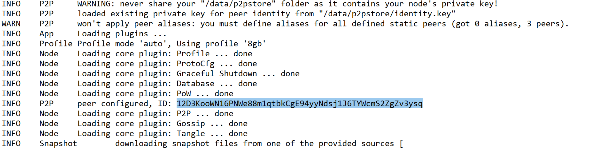

# Deployment

## About IOTA nodes

**IOTA full-nodes** (such as [Hornet](https://github.com/goHornet/Hornet)) are able to start up from a more recent block instead of having to synchronize from genesis. This is made possible by booting the IOTA full-node with recent [snapshots](https://github.com/luca-moser/protocol-rfcs/blob/local-snapshot-file-format/text/0000-local-snapshot-file-format/0000-local-snapshot-file-format.md).

Furthermore, IOTA full-nodes implement the [Storage Pruning](https://www.rosetta-api.org/docs/storage_pruning.html) feature. Per default, they prune history from time to time in a safe way - similar to the nodes in the Bitcoin network that run in pruning mode.

## Instructions

**Following instructions will start a Hornet node together with a Rosetta API instance:**

1) Ensure `docker` and `docker-compose` are installed.
2) Download the [latest release](https://github.com/iotaledger/rosetta-iota/releases) of `rosetta-iota` and extract `rosetta-iota` to a folder of your choice.
3) **The docker image runs under user with user id 65532 and group id 65532.** To make sure there are no permission issues with the Hornet node, prepare the working directories so that Hornet can read and write data to the host system:
    ```
    cd rosetta-iota
    mkdir -p data/storage/chrysalis-mainnet && chown 65532:65532 data/storage/chrysalis-mainnet
    mkdir -p data/storage/chrysalis-devnet && chown 65532:65532 data/storage/chrysalis-devnet
    mkdir -p data/snapshots/chrysalis-mainnet && chown 65532:65532 data/snapshots/chrysalis-mainnet
    mkdir -p data/snapshots/chrysalis-devnet && chown 65532:65532 data/snapshots/chrysalis-devnet
    mkdir -p data/p2pstore && chown 65532:65532 data/p2pstore
   ```
4) **Optionally**: if you want your node to use an already existing node ID, replace the `data/p2pstore` folder accordingly and make sure that the correct permissions are set:
    ```
    chown 65532:65532 data/p2pstore -R
    ```
5) Hornet exposes different functionality on different ports:
      
      - **15600 TCP** - node gossip protocol port (exposed to the Internet)
      
      - **14265 TCP** - node REST API port (exposed to localhost only)
            
      The Rosetta API exposes following ports:
      
      - **3030 TCP** - Rosetta API port (exposed to localhost only)
      
      The mentioned ports are important for flawless node operation. Make sure port **15600** is accessible from the Internet else your node will not be able to interact with other nodes. If you want to change a port, you can do so in the docker-compose files.
         
6) Add your peer(s) - to which your node should connect. For `chrysalis-mainnet`, add the peers to the `Hornet/chrysalis-mainnet/peering.json` file. For `chrysalis-devnet`, add the peers to the `Hornet/chrysalis-devnet/peering.json` file. If you don't have any peers, please contact us and we will help you find some.

    For better illustration, the `peering.json` file should then look like the following, for example:
    ```json
   {
     "peers": [
       {
         "multiAddress": "/dns/xyz.com/tcp/15600/p2p/12D3KooWEVGFchjYqCH1nAWt2norb6sJYEedmEkPofoNiyDwyptf",
         "alias": "Alice"
       },
       {
         "multiAddress": "/ip4/121.56.12.23/tcp/15600/p2p/12D3KooWRNYKZXYqZngxQee5BefmzcW5Zk6Tc6iE92U2uZwArHw9",
         "alias": "Bob"
       }
     ]
   }
   ```
          
7) Share your own Hornet multiaddress with your peers so that they will be able to mutually tether. A multiaddress - as illustrated above - consists of:
    - the Internet address to reach your node (e.g. `/dns/xyz.com` or `/ip4/121.56.12.23`)
    - the node gossip protocol port (e.g. /`tcp/15600`)
    - your node ID (e.g. `/p2p/12D3KooWRNYKZXYqZngxQee5BefmzcW5Zk6Tc6iE92U2uZwArHw9`)
    
    You can find your node ID in the logs when you run the implementation. Please look for an entry like:
    
    
       
8) Run the implementation in `online/offline` mode for the desired network:

    **chrysalis-mainnet**
    ```
    MODE=online docker-compose -f docker-compose.chrysalis-mainnet.yml up
    ```
    
    **chrysalis-devnet**
    ```
    MODE=online docker-compose -f docker-compose.chrysalis-devnet.yml up
    ```

9) If you want to reuse the node ID with a later deployment (**see step 4.**) make sure you back up the `data/p2pstore` directory. Otherwise, you cannot reuse the same node ID for subsequent deployments. 

10) Your node will now try to synchronize with its peers. You can check its health status at: [http://127.0.0.1:14265/api/v1/info](http://127.0.0.1:14265/api/v1/info)
11) Congratulations, you are done! You can access the Rosetta API at port [3030]().

## Further notes:

The node will be bootstrapped automatically with recent snapshots to start synchronizing from a more recent block. For `chrysalis-mainnet`, the snapshots will be automatically downloaded from [https://chrysalis-dbfiles.iota.org](https://chrysalis-dbfiles.iota.org). For `chrysalis-devnet`, the snapshots will be automatically downloaded from [http://dbfiles.chrysalis-devnet.iota.cafe](http://dbfiles.chrysalis-devnet.iota.cafe). If you want to bootstrap the node yourself, you can do so by placing your snapshots appropriately in the `data/snapshots` directory.

